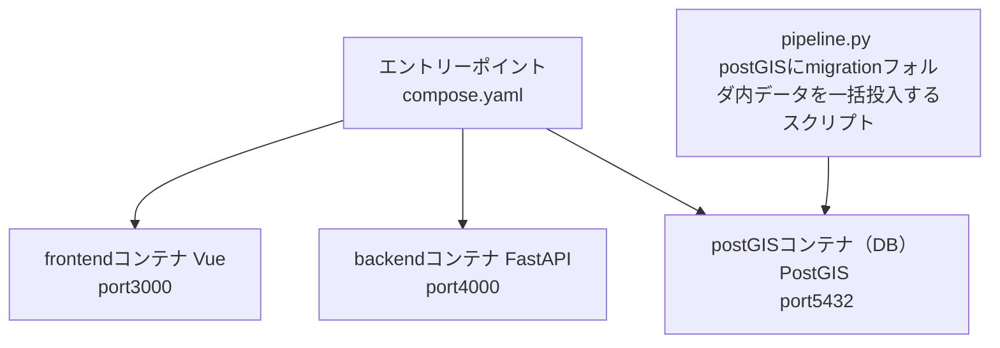
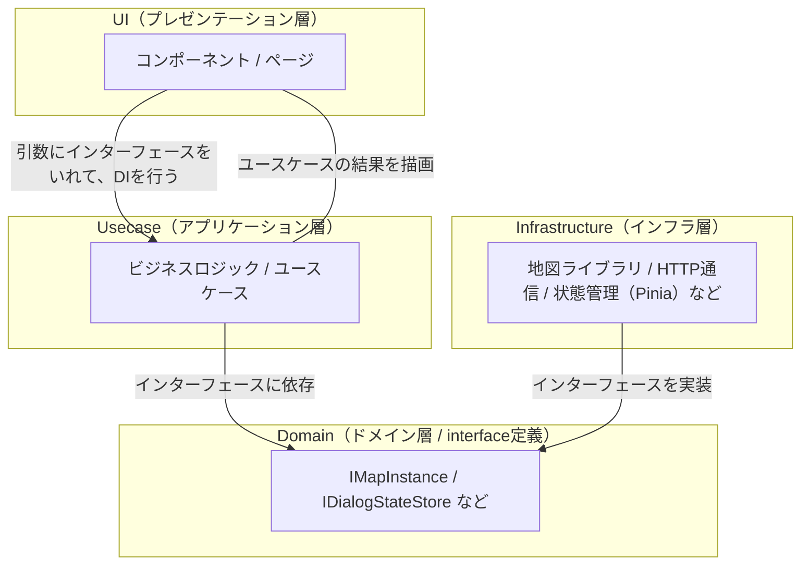
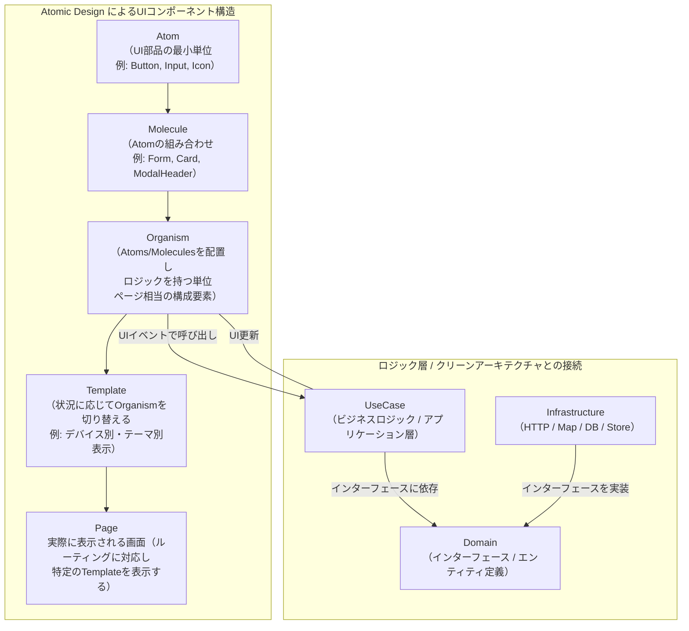
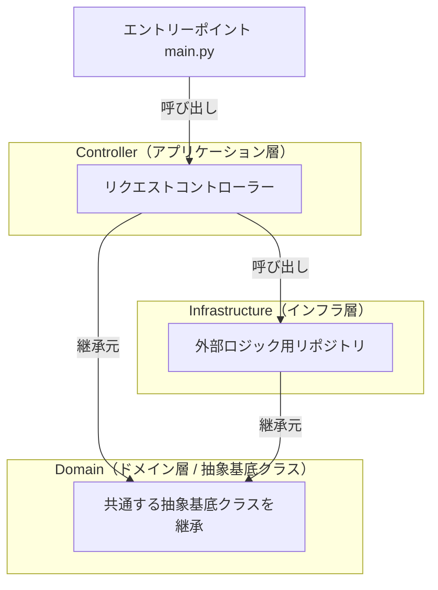

## リポジトリ

https://github.com/mayuge/SPECTRA

## 主な使用技術/プラグイン

### フロントエンド

<p>
    
    
    
    
    
    
    
</p>

### バックエンド

<p>
    
    
    
</p>

### その他プラグイン/開発支援ツール

<p>
    
    
    
    
    
</p>

## 環境構築

- ### docker 環境を準備
  [docker 公式スタートガイドページ](https://www.docker.com/get-started/)
- ### node 環境を準備
  - node のバージョン管理は [volta](https://docs.volta.sh/guide/getting-started) がおすすめ。指定バージョンの node 環境、パッケージマネージャーを用意してください

  ```
  node v24.12.0
  ```

  ```
  pnpm v10.22.0
  ```

  - ビルドする際、ファイルの大文字小文字の区別をしっかりと管理しないと表示されない場合があるので注意してください

- ### 初期データ取得

  [こちら](https://drive.google.com/drive/folders/1ASBWmogy64pGH4hvqwTM9xYL0mg-w1hO)から取得したものを`02_src\SPECTRA_CHAT\migration`に配置

- ### env ファイル追加
  - 02_src\SPECTRA_CHAT\backend 直下に`.env`ファイルを追加。このとき、.env ファイルの形式は、`env.txt`を参考にすること。

  ```
  //.envの例
  GEMINI_API_KEY=XXXXXXXXXXXXXXXXXXXXXXXXXXXXXX
  ```

- ### アプリケーションを立ち上げる方法
  - 02_src\SPECTRA_CHAT に移動

  ```
  docker compose up --build
  ```

  ```
  python pipeline.py
  ```

  - 02_src\SPECTRA_CHAT\frontend に移動

  ```
  //package.jsonの中身を適用
  pnpm install
  ```

  ```
  //開発サーバーを立ち上げ
   pnpm run dev
  ```

  ```
  //ローカルネットワーク経由で開発サーバーを確認できます。フロント側の`.env`ファイルを`localhost`から一時的に変更してください。
  pnpm run dev --host
  ```

  [`http://localhost:3000/`](http://localhost:3000/)をブラウザで開く

## ディレクトリ構成

```
.
├── 01_docs //主に資料をここに置く
├── 02_src　//本番プロジェクトをここに置く
│   └── SPECTRA_CHAT //アプリケーションディレクトリ
│       ├── frontend
│       │   ├── src
│       │   │   ├── presentation
│       │   │   │   ├── atoms //最小単位のUIコンポーネント　htmlのタグと対応　どのページでも使い回す
│       │   │   │   ├── molecules //atomsを組み合わせたもの　どのページでも使い回す
│       │   │   │   ├── organisms　// ページ単位でに管理するUIコンポーネント
│       │   │   │   │   └── homeSite //　【ページ名】Site
│       │   │   │   │       ├── __tests__ //テストコード格納フォルダ use【機能名】App.test.ts
│       │   │   │   │       ├── core　//usecase アプリケーションロジック　use【機能名】App.ts
│       │   │   │   │       └── ui //ロジック(機能)と接続するUI　【ページ名】SiteMain.vue、【機能名】App.vue
│       │   │   │   └── templates　//ロジック接続後のUI　基本的にページを表示するだけ 【ページ名】
│       │   │   ├── domain
│       │   │   │   ├── interfaces　// インターフェイスをまとめて保存
│       │   │   │   ├── types　//型をまとめて保存
│       │   │   │   └── params //固定値をまとめて保存
│       │   │   ├── infrastructure
│       │   │   │   └── stores //状態管理ストア
│       │   │   ├── App.vue // UIのエントリポイント　AtomicDesignのPagesにあたる
│       │   │   ├── main.ts　//ロジックのエントリポイント
│       │   │   └── style.css //CSSのエントリポイント
│       │   ├── public //画像、アイコン、素材を置く
│       │   └── package.json //フロントエンドで使用しているライブラリの管理を行う
│       ├── backend
│       │   ├── main.py //エントリポイント
│       │   ├── controller //httpのエンドポイント兼MCP
│       │   ├── infrastructure　//外部ライブラリを使用したロジックを隔離
│       │   └── domain //抽象基底クラスを保管
│       ├── migration //DBに初期投入するデータを保管
│       ├── pipeline.py //DBに初期投入するスクリプト
│       └── compose.yaml //アプリケーション全体のエントリポイント
└── 03_prototype　//プロトタイププロジェクトをここに置く
```

## アプリケーション全体のアーキテクチャ

- モノリシックなソフトウェア構成
- Docker コンテナごとに分けて実装
- 要素間は port 番号を指定して通信する
- backend は、[`http://localhost:4000/docs`](http://localhost:4000/docs)にてアクセスを swagger で検証できる



## フロントエンドのアーキテクチャ

- DI(依存性の注入)によって、依存性逆転の原則を保つ
- usecase（純粋な内部ロジック）と infrastructure（外部ロジック）がインターフェースを介してやり取りを行うことで、内部ロジックをクリーンに保つことができる。
- コメントは TSDOC 方式を推奨
- テストコードには vitest を用いる
- インデントには prettier を、ビルドチェックに eslint を用いる



## AtomicDesign による UI コンポーネントマネジメント

- コンポーネントを階層的に管理することで、UI の拡張性を高める
- コンポーネントは storybook で管理する



## 　バックエンドのアーキテクチャ

- 基本的にはフロントエンドと同じ。
- ruff コマンドを使ってインデントを修正できる

```
uv run ruff format
```

# postgres に入るコマンド

```
docker exec -it postgis_container psql -U docker -d postgres
```

## テーブル名一覧取得

```
\dt
```



## 開発支援ツール

- frontend ディレクトリに移動

```
 pnpm typedoc
```

- TSDoc 形式で書かれた ts ファイルのコメントが反映される
- [TSDoc 形式とは](https://dev.classmethod.jp/articles/jsdoc-cheatsheet/)
- 自動でドキュメントを生成する

## デザインガイドライン/デザインシステム

- UX を担保するために良いデザインの客観的基準を決める必要がある。
- デザインにセマンティックな効果（機能）をもたせる。→ デザインの意味をいちいち考える

- ### デザインシステムとは？ 組織での事例
  - [デジタル庁デザインシステム](https://www.digital.go.jp/policies/servicedesign/designsystem)
    - デジタル庁のデザインシステムの内容は入札案件の評価基準となりうるため要件を確認すること
  - [freee 株式会社 vibes](https://vibes.freee.co.jp/?path=/docs/doc-readme--docs)
  - [SmartHR Design System](https://smarthr.design/)

  - ### カラー
    - [デジタル庁デザインガイドライン　カラーパレット](https://design.digital.go.jp/dads/foundations/color/color-palette/)

    - [BootStrap5 ユーティリティカラー](https://getbootstrap.com/docs/5.3/utilities/colors/)

    - グレースケールに関しては明度を 10 段階に分けたものを使用する。
    - グレーの代表的な色を`#808080`とする。

    ```
      color-gray-10: #1a1a1a;
      color-gray-20: #333333;
      color-gray-30: #4d4d4d;
      color-gray-40: #666666;
      color-gray-50: #808080;
      color-gray-60: #999999;
      color-gray-70: #b3b3b3;
      color-gray-80: #cccccc;
      color-gray-90: #e6e6e6;
    ```

    - 基本的に文字は白・グレー・黒のどれかにする。→ 文字に彩度はなるべく入れない
    - 本文テキストは 背景とのコントラスト比 4.5:1 以上
    - リンクと間違えるので、文字は青くしないこと（紫もダメ）

    ### セマンティックカラー
    - 色に役割（機能）をもたせる仕組み(装飾目的で使わない)
      - primary テーマカラー → そのアプリのブランドカラーとしての役割を持つ
      - secondary サブカラー → テーマカラーを補助する役割を持つ、primary と似た色は控える
      - success→ 正常状態を表す色　基本グリーン系、処理が正常/良好に行われていることを示し、安心感を与える。「電車は予定通り運行中」
      - warning→ 中立的なイメージかつ注目状態を示す。オレンジ系? 「黄色い線の内側にお並びください」
      - danger→ 危険な状態/取り返しがつかない状態/絶対に気づかないといけない状態「データを削除しますか。この動作は取り消しできません」

  - フォント
    - NotoSansJP を使用する
    - 4px の倍数で作成する → 実際には無理

  - アイコン
    - サービスごとに制作するのが望ましい
    - googleMaterialIcon の CDN サービスはテスト利用で便利

  - 余白
    - 4px の倍数で作成する
    - まずはボックスレイアウト配置(左右上下余白を揃えるかつ等間隔)を心がける

  - ボタン
    - 誤タップを防ぐために 24px × 24px 以上大きくする

- ### 判断に迷った場合は以下を優先する：
  1. 誤操作を防げるか
  2. 初見ユーザーが理解できるか
  3. 一貫性が保たれているか
  4. 実装が単純か
