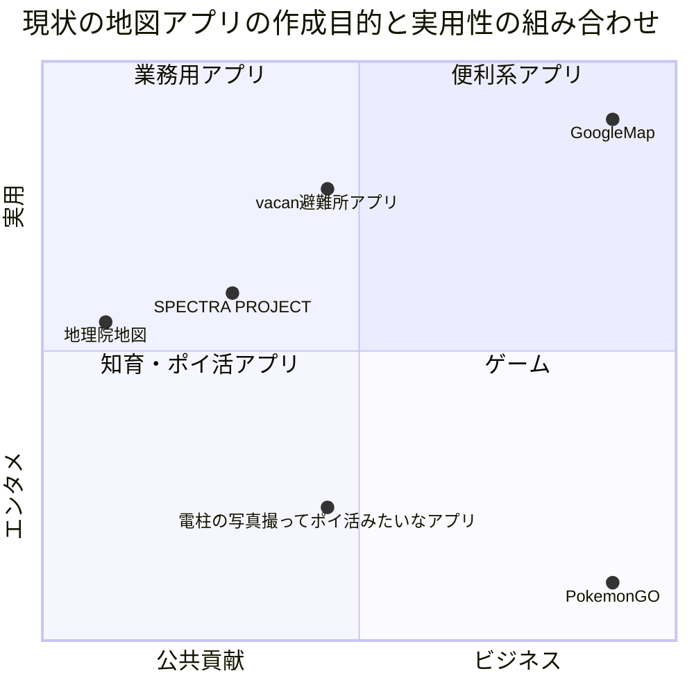
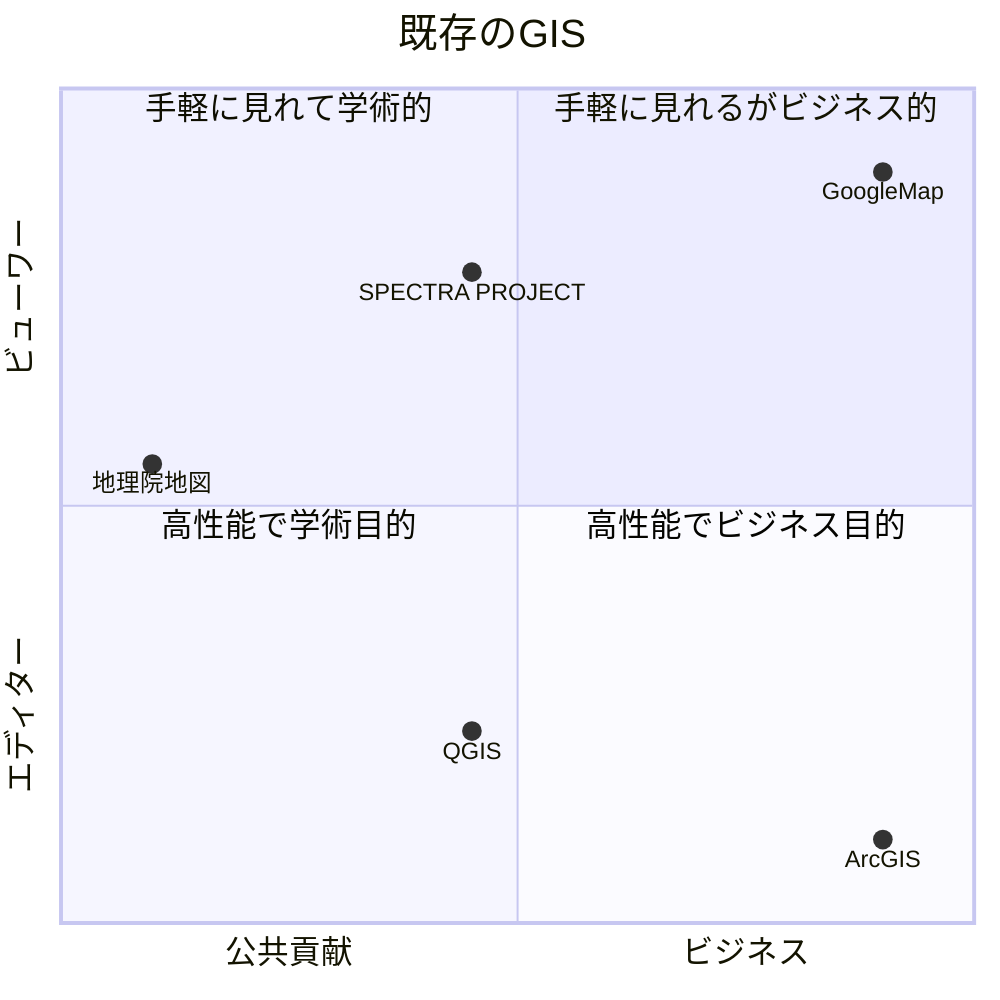
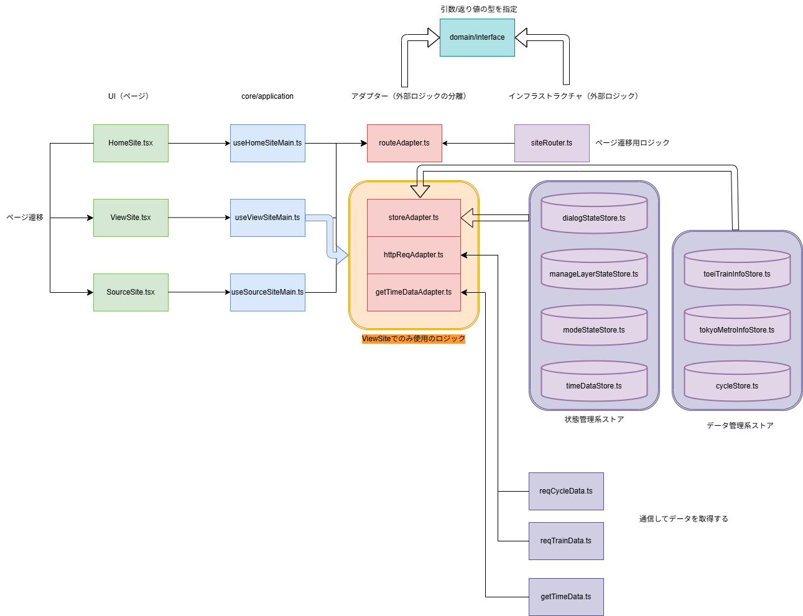

### 主な使用技術

  

### 現状の市場分析

### 現行システム参考動画

- 

### 現行システムアクセス URL

- 

### フロント側構成

### 全体フォルダ構成

- 01 設計 → 設計資料等保管用
- 02src→ 本番用
- 03 プロトタイプ → 技術検証用
  - deckgl で後継アプリの実装を検証中（2025/05/28）
  - rag 構築による対話型の gis の可能性について模索中

### フォルダ構成は基本的に atomicDesign です。

- atoms と molecules フォルダには汎用的な UI 部品が格納してあり、npm storybook コマンドでご確認いただけます。
- 
- 

### システムアーキテクチャは cleanArchitecture、ヘキサゴナルアーキテクチャ使ってます。

- 
- DDD における UI とそれに付随するアプリケーション層を infrastructure 層と分離するために間に domain で指定したインターフェースを挿入した adapter 層（腐敗防止層）を追加する構成となっている。

### サーバー構成

