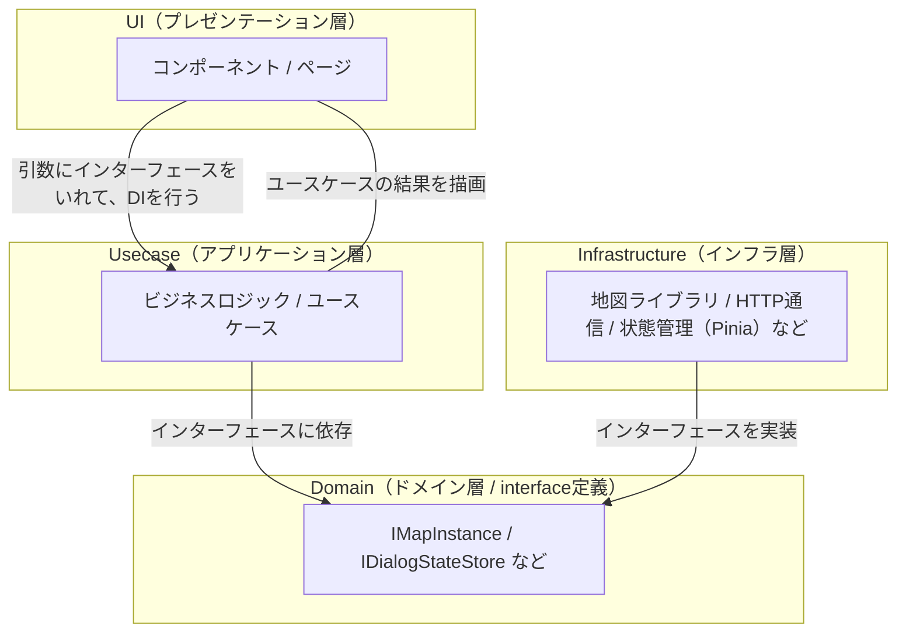
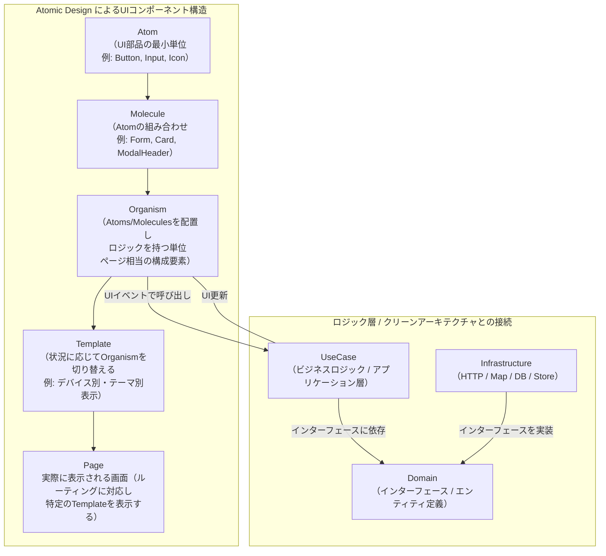
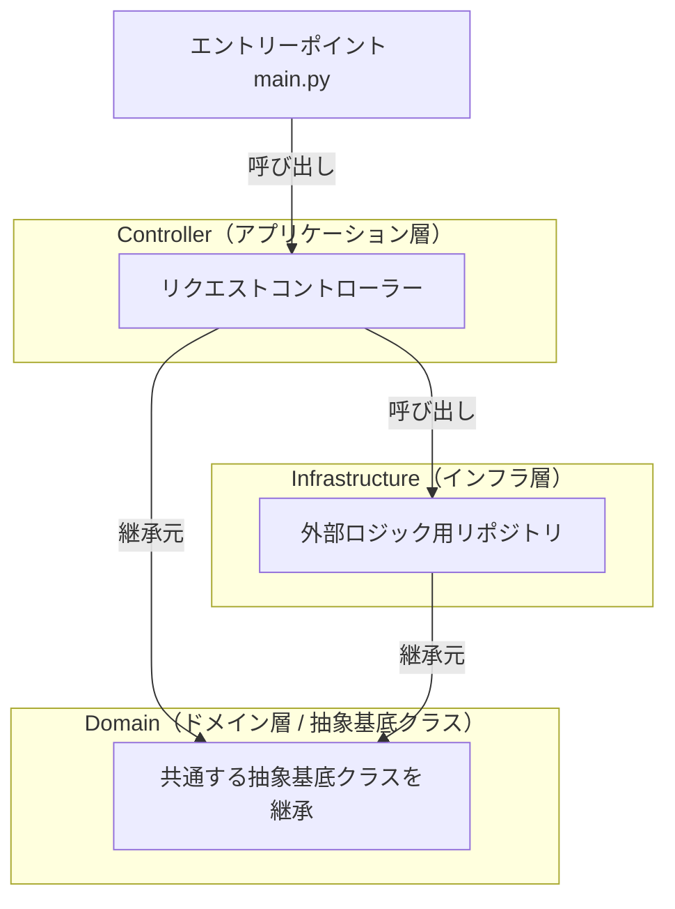

## 主な使用技術

## アプリケーション全体のアーキテクチャ

- モノリシックなソフトウェア構成
- 要素間は port 番号を指定して通信する

## フロントエンドのアーキテクチャ

- DI(依存性の注入)によって、依存性逆転の原則を保つ
- usecase（純粋な内部ロジック）と infrastructure（外部ロジック）がインターフェースを介してやり取りを行うことで、内部ロジックをクリーンに保つことができる。

## AtomicDesign による UI コンポーネントマネジメント

- コンポーネントを階層的に管理することで、UI の拡張性を高める

## 　バックエンドのアーキテクチャ

- 基本的にはフロントエンドと同じ。

